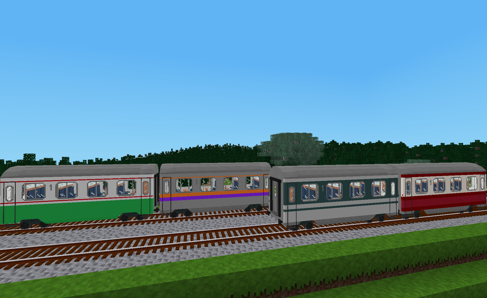

# Classic Coaches Generic Livery Pack
This mod adds generic livery options for the wagons in the **Classic Coaches** mod.

## Liveries
This livery pack provides 9 additional livery templates for each of the 4 intercity passenger wagons in the **Classic Coaches** mod. These livery templates each have multiple overlays that can be customized by players while in game to create many different livery designs.  These liveries are generic in that they do not have any language based logos or railway identifiers.  Also included are several predefined liveries that are intended to showcase some of the livery design possibilities with the included templates.

For mod developers, this mod is also intended to serve as an example of how to implement a livery pack with more complex livery templates such as those with multiple overlays.
## Licenses
Copyright © 2023-2024 Marnack
- Classic Coaches Generic Livery Pack code is licensed under the GNU AGPL version 3 license, see [LICENSE.txt](LICENSE.txt) for details.
- Unless otherwise specified, Classic Coaches Generic Livery Pack media (textures and images) are licensed under [CC BY-SA 3.0 Unported](https://creativecommons.org/licenses/by-sa/3.0/).
### Attributions
The following items from prior art were included in whole or in part in this mod:
- From the mod for Minetest named "moretrains_basic" in the "minetest-moretrains" modpack:
	- Textures for the bogie, wheels and buffers (CC BY-SA 3.0 by rbduck)
