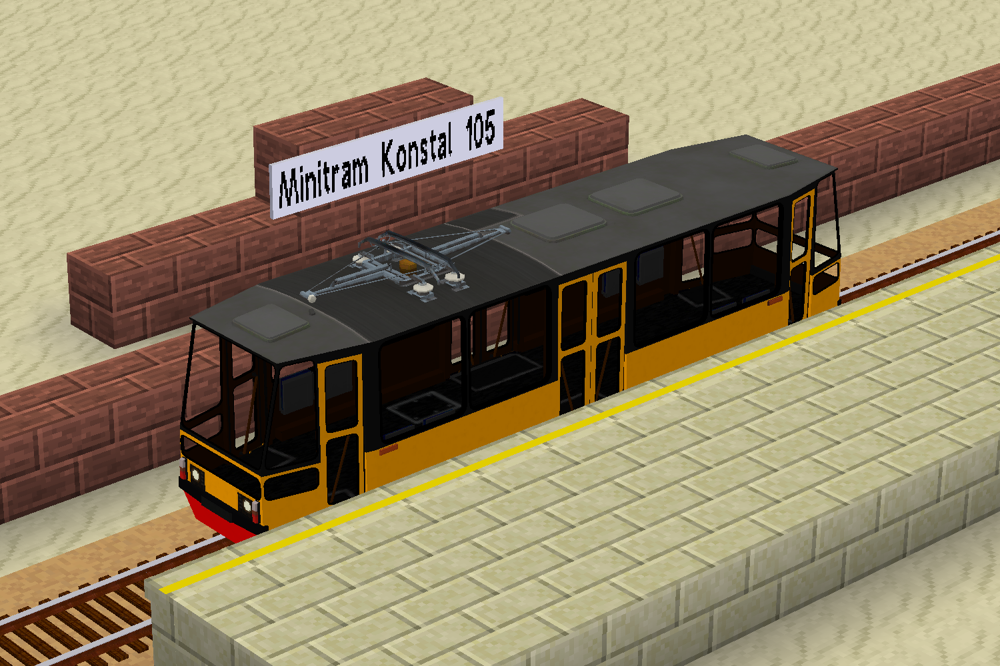
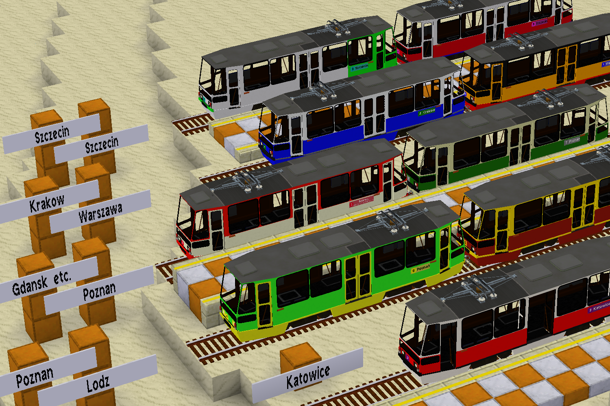
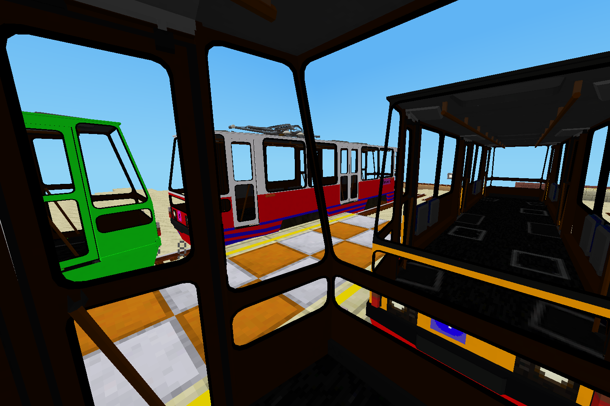

<!--
SPDX-FileCopyrightText: 2022 David Hurka <doxydoxy@mailbox.org>

SPDX-License-Identifier: MIT
-->

# doxy’s Minitram (doxy_mini_tram)

This mod adds a Minitram Konstal 105 train model to `advtrains`, which is a scaled down variant of the Konstal 105N tram.







## About

On the LinuxForks Minetest server we realized that `advtrains` is missing train models which allow for a panoramic view.
Therefore, it is currently not possible to make scenic railways with appropriate trains.

The Minitram Konstal 105 train model shall fill this gap.
The Konstal 105N is a tram series from eastern europe, which was built in huge numbers, and is now ubiquitous for most tram services in eastern europe.

Relevant for this mod is that it has an angular look, which is suitable for a low poly game like Minetest; and a length of only 13.5m, so it fits well in `advtrains`.
But most important: it has really big windows!
The windows are even bigger than busses use to have, so the nickname “aquarium” is not that bad. ;)

## Mods in this modpack

### advtrains_attachment_offset_patch

Adds “attachment dummy” objects to seats in `advtrains` wagons, so the Minetest client will set the eye position correctly.
(Will probably be released as independent library mod.)

### minitram_konstal_105

Contains the “Minitram Konstal 105” train model.

### minitram_konstal_105_liveries

Contains 11 livery layers for the Minitram Konstal 105, which can be painted using the `bike_painter` painting tool from the `bike` mod. (Paint `#000000` 0% Alpha for help.)

### minitram_crafting_recipes

Contains crafting recipes and several intermediate craft items for the Minitram Konstal 105.
In the future, these intermediate craft items would be used for any additional Minitram vehicles.
This mod contains compatibility code for several other mods’ items.

### multi_component_liveries

Contains the logic used by `minitram_konstal_105_liveries`.
(Will probably be released as independent library mod.)

### visual_line_number_displays

Renders actually visible displays from the “text outside” property of `advtrains` trains. See <https://invent.kde.org/davidhurka/doxy_mini_tram/-/tree/master/visual_line_number_displays> for the “display string” syntax reference.
(Will probably be released as independent library mod.)

## Installation

This mod is intended to be installed from Minetest’s own content manager, [ContentDB](https://content.minetest.net/doxygen_spammer/doxy_mini_tram).

You can also clone the repository to your `mods` folder.
You will need to disable the “LICENSES” and “screenshots” mods, if your Minetest can not figure out that these aren’t mods.

You can also use this `bash` command from the root directoy of the repository:

```bash
git archive --format tar HEAD | tar --extract --one-top-level=doxy_mini_tram --directory=path/to/minetest/mods/
```

(Using GNU tar.)

Note that `git-archive-all` does **not** work correctly wtih this repository.

## License

The mod is licensed as CC-BY-SA-4.0 (media) and MIT (code).

Screenshots depict artwork from other Minetest mods, and are licensed as CC-BY-SA-4.0.

Individual files, or sections of code, use other licenses like LGPL-2.1-only.
Every single file contains exact copyright and licensing information.

## Contributing

The source code is hosted at <https://invent.kde.org/davidhurka/doxy_mini_tram>.
Problems should be reported at <https://invent.kde.org/davidhurka/doxy_mini_tram/issues>.
