<!--
SPDX-FileCopyrightText: 2022 David Hurka <doxydoxy@mailbox.org>

SPDX-License-Identifier: MIT OR CC-BY-SA-4.0
-->

# visual_line_number_displays

This mod gives `advtrains` wagons the ability to show actual line number displays on their objects.
These displays may show just the line number; or the line number, the train’s destination, and extra information.
This is comparable to the line number display feature on the subway wagon from `basic_trains`.

## Display string syntax

The user interfaces with this library by setting the outside display property of `advtrains` trains.
This property uses _display string syntax_, which is described here.

### Display string syntax features

A display string may be just a number, but it may also use these syntax features.

#### Brace blocks

Sections of text may be enclosed in a _brace block_.

Brace blocks have the format `{a|b|c|...}`, with any number of parts separated by bar characters.
Usually, the last part is used as text that is rendered, and the other parts specify options.

#### Background shapes

Brace block options can be used to enclose text in a _shaped background block_.

There are square (rectangular), round, and diamond shaped block.

These background shape options are available:

 * `[]` or `square`
 * `()` or `round`
 * `<>` or `diamond`
 * `_[]_` or `square_outlined`
 * `_()_` or `round_outlined`
 * `_<>_` or `diamond_outlined`

Example: `{()|This text has an oval background}`

It is not possible to nest text blocks.

Brace blocks without a background shape option may be called _shapeless block_.

#### Background patterns

Shaped blocks are usually drawn in the current _background color_.
There is also a _secondary background color_, which is used for _background patterns_.

A background pattern can be added to a shaped block by adding one brace block option.

Background patterns are identified by the background halves or quarters which are drawn in the secondary background color.
The halves and quarters have names like `left`, `lower`, `upper_left`, ...
The digits 1 to 4 can be used for the corners, using the _BSicon_ corner numbering scheme.

These background pattern options are available:

 * `left`
 * `right`
 * `upper`
 * `lower`
 * `upper_left` or `4`
 * `upper_right` or `1`
 * `lower_left` or `3`
 * `lower_right` or `2`
 * `upper_left_lower_right` or `24`
 * `upper_right_lower_left` or `13`
 * `left_right`
 * `upper_lower`

Example: `{()|4|This} goes in a circle with the upper left half in the secondary background color.`


#### Display sections

A display has up to three sections:

 * _Number_ section, shown on the left.
 * _Text_ section, shown on the right.
 * _Details_ section, shown below the text section in smaller font.

The display string advances to the next section when a semicolon or line break (outside a brace block) is encountered.

An `advtrains` wagon definition may restrict individual displays to certain sections.
The other sections are then not shown on these displays.
This can be used to simulate the rear display of a bus, which usually shows only the line number but no destination.

Example: With the display string `152; North`, the rear display shows only `152`.

#### Line breaks

As described above, line breaks using the line break character separate different display sections.

To get a line break within a shaped or shapeless block, you can use a double space or an _entity_.

Example: `{Two  lines} {and{NewLine}three{nl}lines}`

#### Text features

Text features are strokes drawn on or under the text glyphs.

Features can be applied to any brace block by adding any of these options.

Diagonal strokes are identified by their BSicon corner digits.

These feature options are available:

 * `stroke_13_foreground` or `/`
 * `stroke_foreground` or `-`
 * `stroke_24_foreground`
 * `stroke_13_background`
 * `stroke_background`
 * `stroke_24_background`

_Text features_ can be used to make “stroked lines”.

Example: `{[]|/|12}; North; (Express line)`

Text features use the _feature color_.

#### Color brace sequences

There are four colors which can be set individually:

 * Text color (`text`, `t`)
 * Background color (`background`, `b`)
 * Secondary background color (`secondary_background`, `pattern`, `s`, `b2`, `p`)
 * Feature color (`feature`, `f`)

These colors are set automatically when the display string contains a number, using the color algorithm of the `basic_trains` subway wagon.

Using _color brace sequences_, the colors may be set explicitly.
A color brace sequence is the color identifier (from the list above), followed by a colon and a HTML style hexadecimal color; enclosed in a brace pair.
The hexadecimal color consists of a `#` sign, and three or six hexadecimal digits.

Example: `{background:#fff} White Line`

When a color is set explicitly, the other colors are recalculated automatically to ensure some color contrast.

It is possible to reference the background color of a certain line, by using the line identifier in double quotes.

Example: `{background:"1"}{secondary_background:"2"}{()|stroke_13_background|1-2 Combo Line}`

It is possible to use the whole color scheme of another line with the `all` or `a` identifier.
In this case, the line may be identified as string or as integer, which depends on the mod which defined that line.
The builtin subway wagon color schemes are identified as integer.

Example with integer: `{all:1}[[101]]; Shuttle to Line 1`
Example with string: `{a:"S1"}<<S101>>; Shuttle to Line S1`

Color brace sequences may be used inside or outside of brace blocks.

If they are used inside, the colors are applied only to the whole brace block.

If they are used outside, i. e. in a _braceless block_, the colors are applied to all following blocks and text.
If they are used inside a _shapeless block_, the shapeless block is split.

Example inside shaped blocks: `{b:#000} {[]|{b:#0d0}Green square} {[]|{b:#f00}Red circle}`
Example inside shapeless blocks: `{{t:#000}Black text} {{t:#f00}Red text}`
Example inside a braceless block: `{t:#000}Black text} {t:#f00}Red text`

Inside a brace block, the color brace sequence may be turned into a brace block option.

Example: `{t:#000|Black text} {[]|b:#0d0|Green square}`

It is possible to “unset” a color which has been set explicitely before.
This is done by not providing any color after the colon.

Example: `{[]|1}; White text {t:#f00} Red text {t:} White text`

This causes the color to be calculated automatically.
It is usually safe to do this for the text color.
Line color schemes usually set the background color.
Deleting the background color would cause the whole color scheme to “disappear”, which may affect more colors than you think.

#### Entities

_Entities_ allow to enter characters which are not supported by your keyboard or Minetest’s keyboard handling.
They also allow to escape characters which would otherwise be considered part of the syntax.

Entities are written with their name in a single brace pair.

Example: `{lcurl}12{rcurl}; This line is enclosed in braces.`

These entities are provided:
 * `{`, `}`, `{{`, `}}`: lcurl, rcurl, llcurl, rrcurl
 * `[`, `]`, `[[`, `]]`: lbrak, rbrak, llbrak, rrbrak
 * `(`, `)`, `((`, `))`: lpar, rpar, llpar, rrpar
 * `<`, `>`: lt, gt
 * `|`: bar, vline
 * `-`: dash, minus
 * `/`: slash
 * `\`: backslash, bslash
 * ` `: space, sp
 * Line break: nl, newline
 * `:`: colon
 * `;`: semicolon, sc
 * `=`: equals, equal, eq
 * `"`: quote
 * `#`: hash
 * `_`: underscore, us

In addition the HTML 4 and HTML 5 entities are supported, for those glyphs which are available in `font_metro`.

_Numeric entities_ allow to insert any UTF-8 encoded character, even those not supported by `font_metro` or Unicode.

They are written like HTML numeric entities, as a hash followed by a decimal number, or as `#x` followed by a hexadecimal number.
Like in HTML, the number encodes the codepoint, not the UTF-8 representation.

Example: `Lots of{sp}white{#32}space{#x20}here.`

Entities may be used within brace blocks.

Example: `{[]|single {sp} line {sp} box}`

#### Escaping with backslash

Any character may be escaped with a backslash (including the backslash itself), to avoid them being interpreted as syntax.

Example: `{[]|Box\|containing\|bar\|characters}`

Escaping with backslash is usually a more straightforward alternative to entities.

#### Macros

_Macros_ work similar to entities, as they are replaced with another string.
While entities are parsed in the last step, macros are parsed very early,
so macros may contain any other syntax (and even other macros).

Like entities, macros are identified by their name, and are written with the name enclosed in single braces.

Macros may receive arguments following their name, using the brace block syntax.
Arguments may contain any syntax, including other macros.

Example: `{Warning_Label|33  1202}` may turn into `{_[]_|b:#d80|t:#000|f:#000|-|33  1202}`, which will look like the warning label for gasoline.

There are no macros provided by default.
Other mods may register their own macros.

More information is found at the end of this file.

#### Syntax errors

In most cases, syntax errors are passed through until the text is rendered, i. e. invalid syntax will appear as plain text on the final display.

This allows you to see where syntax is invalid.

You can deliberately use invalid syntax to avoid using entities.
Invalid syntax may often be considered “no syntax”, but still it is debatable whether this is good practice.

### Display string syntax examples

This table contains examples of display string syntax, to illustrate the above syntax reference.

The pictures are actual renderings of the generated texture strings, created with a hacked Minetest client.
Here they are upscaled so any device shows them without filtering.

The data in this table is used as unit test.
See the files `autotests/manual_pictures.lua` and `autotests/manual_spec.lua`.

To generate the pictures, you need a Minetest client with the [`save-texture-string-as-png`](https://github.com/doxygen-spammer/minetest/tree/save-texture-string-as-png) branch applied.
The file `autotests/render_manual_pictures.lua` registers the chat command `/render_manual_pictures`, which will send all test displays as texture string to the client.
The client will then render this texture, find a specialized `[save:` texture modifier, and save the texture at the specified location.

<table>
<tr><th>Rendering</th><th>Display string input</th><th>Comments</th></tr>
<tr><td></td><td>

`1`

</td><td>

Plain line numbers may be entered directly, as-is.

</td></tr>
<tr><td></td><td>

`2`

</td><td>

For single-digit decimal line numbers, the background color is taken from the `basic_trains` subway wagon’s color list.

</td></tr>
<tr><td></td><td>

`U3`

</td><td>

Line numbers may contain additional letters, the background color lookup uses only the digits (and optionally a minus sign).

</td></tr>
<tr><td></td><td>

`4a`

</td><td>

Display strings as simple as these will result in a rectangular box, filled with the background color, with the text in the middle.

</td></tr>
<tr><td></td><td>

`{square|5}`

</td><td>

Using a _brace block_ with the option `square`, the text can be enclosed in a rectangular box.
This is called a _shaped block_.

The shaped block takes the color associated with this line.
The display background is slightly shaded to make the box visible.

</td></tr>
<tr><td>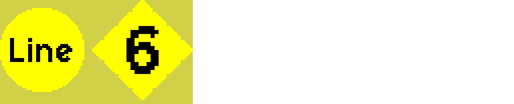</td><td>

`{round|Line} {diamond|6}`

</td><td>

Shaped blocks are also available in round and diamond shape.

It is possible to use more than one shaped block.

The left block does not contain digits, and therefore does not affect the line color lookup.

</td></tr>
<tr><td></td><td>

`{square_outlined|Outlined} {round_outlined|7th} {diamond_outlined|Line}`

</td><td>

Shaped blocks are also available in a variant with a thin outline.
The outline uses the text color.

In this example, it is not necessary to shade the display background, because of the outlines.

</td></tr>
<tr><td>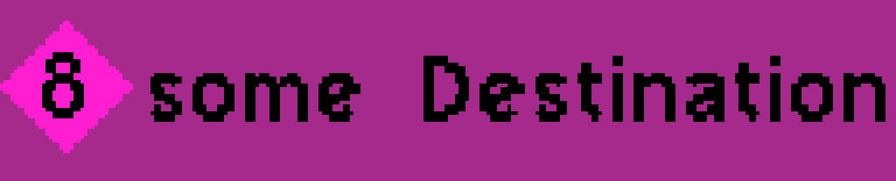</td><td>

`{<>|8}; some Destination`

</td><td>

The background shape options are also available in symbolic forms `[]`, `()`, and `<>`.

The semicolon advances to the next _display section_.
There are three display sections, called _number_, _text_, and _details_.

Here, the text “some Destination” is only shown on displays that have the _text_ section enabled.
Smaller displays may choose to show only the _number_ section.

</td></tr>
<tr><td></td><td>

`{[]|9}↵some Destination↵via {<>|some} {stopover}`

</td><td>

A line break does the same as a semicolon.
(Here it is visualized with `↵`.)

The _details_ section is shown in a smaller font.

There are four text blocks in the details section.
The text span “via ” is a _braceless block_.
The text span “{stopover}” is a _brace block_.

Between “some” and “stopover” there is a space in a braceless block.
Outer whitespace in braceless blocks is ignored, therefore that block has no meaning.

Any section may contain any number of blocks.
The texture resolution is increased automatically if necessary.

</td></tr>
<tr><td></td><td>

`10`

</td><td>

For line numbers with more than one digit (or negative numbers), the color hashing algorithm from the `basic_trains` subway wagon is used.

</td></tr>
<tr><td></td><td>

`{stroke_13_background|11}`

</td><td>

Any brace block may have _features_, which are strokes drawn above or under the text.

A slash before the text draws a stroke from the bottom-left to the top-right under the text.

Such features may be used for “stroked lines”.

</td></tr>
<tr><td></td><td>

`{[]|stroke_24_background|12}`

</td><td>

Features can be used in shaped blocks too.
They are just an additional option in the brace block.

</td></tr>
<tr><td></td><td>

`{stroke_background|[]|13}`

</td><td>

The order of options in a brace block does not matter.
Only the visible text needs to appear after the last `|` character.

</td></tr>
<tr><td></td><td>

`{/|[]|14}; towards A; via {-|B}`

</td><td>

The options `/` and `-` are shortcuts for strokes in the foreground.
They are useful for stroked lines.

</td></tr>
<tr><td></td><td>

`{()|upper|15}`

</td><td>

Shaped blocks can optionally have a background pattern.

The option `upper` means that the upper part of the background is drawn in the secondary background color.

The secondary background color is calculated automatically from the background color.

</td></tr>
<tr><td></td><td>

`{()|4|16}`

</td><td>

The digits 1 to 4 can be used to color one of the four background corners, with a diagonal separation line.

The corners are numbered like in BSicons from Wikipedia.

</td></tr>
<tr><td></td><td>

`{lower_left|()|17}`

</td><td>

Corners may also be named explicitly.

</td></tr>
<tr><td></td><td>

`{left|round|18}`

</td><td>

See the display string syntax reference for all background pattern options.

</td></tr>
<tr><td></td><td>

`{round|24|19}`

</td><td>

Specifying two corners gives a plus shape.

</td></tr>
<tr><td></td><td>

`{()|left_right|20}`

</td><td>

Similar for an X shape.

</td></tr>
<tr><td></td><td>

`{()|upper_left|21} {()|lower_right|21}`

</td><td>

Every background pattern has an inverse pattern.

</td></tr>
<tr><td></td><td>

`{upper_left_lower_right|()|22};; {upper_right_lower_left|()|22}`

</td><td>

Of course this works in all display sections...

</td></tr>
<tr><td></td><td>

`{_()_|upper_left_lower_right|23} {_[]_|upper_right_lower_left|23}`

</td><td>

...and with all background shapes.

</td></tr>
<tr><td>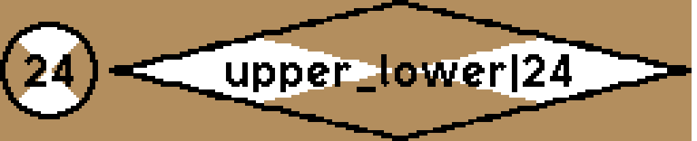</td><td>

`{_()_|upper_lower|24} {_<>_|left_right|upper_lower|24}`

</td><td>

Here, the second block has both `left_right` and `upper_lower` as pattern options.
This is considered invalid syntax, and the second option is passed through.

</td></tr>
<tr><td>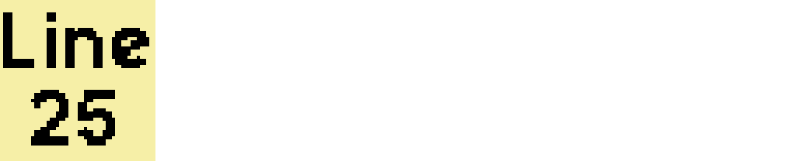</td><td>

`Line  25`

</td><td>

Remember that line breaks cause the display string to advance to the next display section.
With a double space character, a line break can be displayed.

</td></tr>
<tr><td>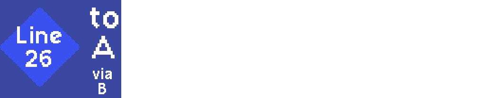</td><td>

`{<>|Line  26}; to  A; {via  B}`

</td><td>

Line breaks with double spaces also work in brace blocks and in all display sections.

</td></tr>
<tr><td>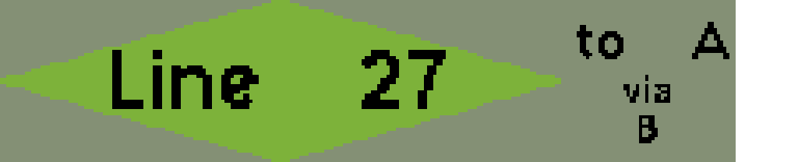</td><td>

`{<>|Line {sp}27}; to {space}A; {via{nl}B}`

</td><td>

To enter double spaces, you need to use _entities_.
Entities can also be used for the line break.

</td></tr>
<tr><td></td><td>

`{<>|Line {}28}; to {space}A; via{NewLine}B`

</td><td>

Empty entities are considered invalid syntax.
Within another brace block, they appear as-is.

</td></tr>
<tr><td></td><td>

`{_<>_|{bar}29\|}`

</td><td>

Entities can be used to escape any character which is relevant for syntax.

It may be easier to escape such characters with a backslash.

</td></tr>
<tr><td></td><td>

`30; K{ouml}ln`

</td><td>

Most HTML 4 entities are supported.

</td></tr>
<tr><td>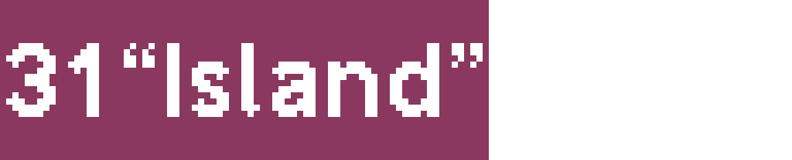</td><td>

`31; {OpenCurlyDoubleQuote}Island{CloseCurlyDoubleQuote}`

</td><td>

HTML 5 entities are supported where `font_metro` has the relevant glyph.

</td></tr>
<tr><td>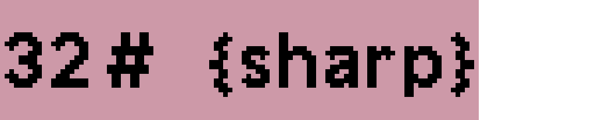</td><td>

`32; {{num} {sharp}}`

</td><td>

`font_metro` does not have a &sharp; glyph, therefore the entity is passed through as-is.

Outside the brace block, this entity would turn into a brace block itself.

</td></tr>
<tr><td>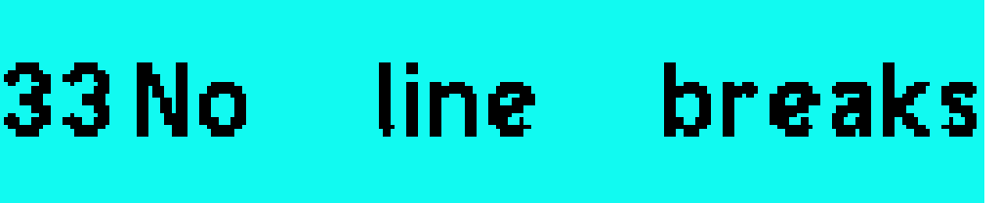</td><td>

`33; No {#32}line{#x20} breaks`

</td><td>

Numeric entities work like in HTML, with the decimal or hexadecimal Unicode codepoint.

If the glyph is not available in `font_metro`, you will see a replacement sign.

Numeric entities may be used to access additional glyphs, which were placed by other mods in the _Private Use Area_ of `font_metro`.

</td></tr>
<tr><td></td><td>

`34; {#08216}Island{#x002019}`

</td><td>

Numeric entities may have leading zeroes.

</td></tr>
<tr><td></td><td>

`{<>|{background:#ffffff}35}; {text:#ffaa00}Orange`

</td><td>

_Color brace sequences_ may be used to explicitly set individual colors.

The color needs to be a HTML-like hexadecimal color with 3 or 6 digits.

</td></tr>
<tr><td></td><td>

`{<>|b:#000|36}; {t:#ffaa00}Orange`

</td><td>

Color brace sequences can be identified with short abbreviations.
See the reference section for them.

They can also be written as options for brace blocks.

</td></tr>
<tr><td></td><td>

`{<>|37}{b:#00f}; Text`

</td><td>

The last background color of the number section will be used as display background color.

</td></tr>
<tr><td></td><td>

`{b:#00f}{<>|38}; Text`

</td><td>

Color brace sequences outside of brace blocks propagate to all following blocks.

</td></tr>
<tr><td></td><td>

`{<>|39}{t:#00f}; Text`

</td><td>

Another example for propagation of the color brace sequence.

</td></tr>
<tr><td></td><td>

`{t:#00f}{<>|40}; Text`

</td><td>

Another example for propagation of the color brace sequence.

</td></tr>
<tr><td></td><td>

`{all:1}{<>|41}; Text`

</td><td>

With the identifier `all` or `a`, you can apply the whole color scheme of a specific line.

If the line is identified as string, it needs to be given in double quotes.
The builtin lines are identified as integer.

</td></tr>
<tr><td></td><td>

`{<>|42}; {_[]_|Some} {a:1} {_[]_|Text}`

</td><td>

Again, the color scheme is only applied to following blocks.

</td></tr>
<tr><td></td><td>

`{<>|{b:\"42\"}43}; {t:\"39\"|Text}`

</td><td>

Instead of a hexadecimal color code, a line number can be referenced.
This is always done with double quotes.
Even if the identifier of the color brace sequence is not `background` or `b`, this will always use the background color of the referenced line.
(The background color is considered the primary color of a line color scheme, because it fills most of the display space.)

Here it can be seen that color brace sequences in shaped blocks are applied only to that block.

</td></tr>
<tr><td></td><td>

`{[]|44}; {t:#0ff} {()|some} {()|text}`

</td><td>

Another example for propagation of the color brace sequence.

</td></tr>
<tr><td></td><td>

`{[]|45}; {t:#0ff} {()|some} {t:} {()|text}`

</td><td>

If no color is provided in a color brace sequence, the color is no longer explicitly set.
It will be recalculated based on any other explicitly set colors.

This works fine for the text color.
Because line color schemes are usually defined by the background color, deleting the background color usually deletes the whole color scheme.

</td></tr>
<tr><td>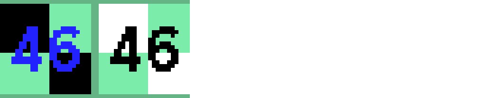</td><td>

`{upper_left_lower_right|[]|secondary_background:#000|46}; {upper_left_lower_right|[]|46}`

</td><td>

An example for automatic recalculation of not explicitly set colors.
The background color is explicitly set by the line number, and the text color is implicitly calculated to give maximum contrast.

For bright green background, the text would be black.
But after setting the secondary background color to black, black text would no longer be readable.

</td></tr>
<tr><td>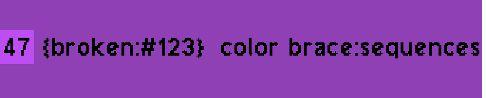</td><td>

`{[]|47}; {{broken:#123} color} {brace:sequences}`

</td><td>

Color brace sequences with invalid identifiers are considered invalid syntax, and are passed through as-is.
Outside of brace blocks, they turn into brace blocks themselves.

</td></tr>
<tr><td></td><td>

`{[]|48}; {t:#1234} broken color brace sequence`

</td><td>

Similar for invalid color codes.

</td></tr>
<tr><td></td><td>

`{[]|49}}; {_[]|wrong} {{}|blocks}`

</td><td>

Invalid brace block options are passed through as-is too.
For example, there is no background shape identified by `{}`.

</td></tr>
<tr><td></td><td>

`{[]|50}; {No {<>|nested blocks}}`

</td><td>

Blocks can not be nested, and this attempt is passed through as-is.

This means that you can write almost any valid display string syntax verbatim into a brace block, but formally this is a syntax error.

</td></tr>
</table>

## How it works

This mod uses the text rendering feature from `font_api` to create texture strings with visible text.
These texture strings can be applied to a texture slot of an `advtrains` wagon’s entity.
The mesh of the entity is responsible for mapping the texture to an area where the line number display shall appear.

This mod includes a syntax parser for the display string syntax.
The syntax allows to specify not only the displayed text, but also its appearance (color, outline); and it allows macros, which may be defined by other mods.

Because of the complex syntax, it was found that the `line` property of an `advtrains` train should not be used.
Instead, **the `text_outside` property is used**, which allows more complex strings without interfering with automatic train control.

This mod adds the necessary logic to the `advtrains` wagon definition.
The logic includes a `custom_on_step()` function, which polls the `text_outside` property to monitor it for changes.
If the property changes, a new display texture is generated and applied to the wagon entity.

## How to use this library

Read the documentation of the `multi_component_liveries` mod to learn how to make a 3D model with a dedicated texture slot for the line number displays.

This texture needs to be UV mapped, so the individual displays appear at the correct position on the model.
The UV mapping may not include rotation, mirroring, or skewing.
The texture needs to show the display in upright orientation.

Describe the UV mapping with a `display_description` table.
This data type is documented in `api.lua`, and describes where displays shall be rendered on the texture.

Call `visual_line_number_displays.setup_advtrains_wagon()` with the `display_description` table, your `advtrains` wagon definition, and the number of the texture slot.
This function adds the necessary logic to the wagon definition.

### Internals

The core function of this library is `visual_line_number_displays.render_displays()`, which does the full work of converting a display string to a texture string, using a `display_description` table.
This function may later be exposed to the API, so other mods may implement line number displays on other objects.

### Line color schemes

This library ships with the color scheme of the `basic_trains` subway wagon, which includes integer line numbers.
Other mods may define color schemes for specific lines.
These lines may be identified as integer or as string.

To define a color scheme, a mod may add elements to `visual_line_number_displays.line_colors`.
This table is documented in `api.lua`.

### Macros

Instead of just providing initial color schemes for specific lines, other mods may provide _macros_, which may be used arbitrarily in display strings.

Macros expand to strings, which may contain any display string syntax, including other macros (up to the recursion limit).
Macros are identified by their name, which is just a string.
They are invoced with their name enclosed in braces.
Macros may receive an argument if the name ends in `=`.

To define a macro, a mod adds an element to `visual_line_number_displays.macros`.
This table is documented in `api.lua`.

#### Macro examples

Macros may be used to hide display string syntax from the user, or to define corporate designs.

Because the display string is visible in the HUD of the train, this will also result in more human readable HUD information.

For example, the macro `Veaca=` may be defined as follows:

```lua
visual_line_number_displays.macros["Veaca"] = {
    "{background:#7000ba}{text:#fff}{()|{Veaca_Logo}";
    1;
    "}";
};
```

If the display string is `{Veaca|{delta}}`, the macro would expand to `{background:#7000ba}{text:#fff}{()|{Veaca_Logo}{delta}}`.
This display string uses two color brace sequences; another macro, `{Veaca_Logo}`; and the entity `{delta}`.
The macro `{Veaca_Logo}` may be defined to expand to a numeric entity, which references a custom glyph placed in the _Private Use Area_ of `font_metro`.

If the company Veaca once decides to change their corporate color scheme, they only need to update this macro to use other colors.
All trains will use the new color scheme, without the need to change line automation infrastructure.
The same way, Veaca may decide to switch from round to diamond shaped displays, or to define colors individually per line.
