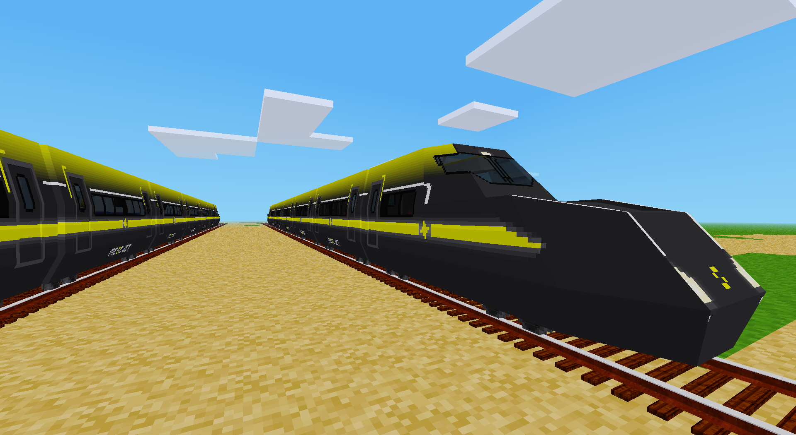

# Mese Trains
Some more trains for the [advtrains](https://content.minetest.net/packages/orwell/advtrains/) mod.  

## Description
Currently the modpack includes only one new train, the MeseJet, which is based on the Japanese train from [moretrains](https://content.minetest.net/packages/gpcf/moretrains/) but with different textures, horn sounds and line display support.

### Features
MeseJet: Lines from 1 to 9 will be displayed on the outside as well as on the inside of the train and will differ in color.

## License
License of textures and models: [CC-BY-SA 3.0](https://creativecommons.org/licenses/by-sa/3.0/) (unless stated otherwise)  
License of sounds: [CC-0 1.0](https://creativecommons.org/publicdomain/zero/1.0/) (unless stated otherwise)  
License of code: [LGPL 2.1 only](https://spdx.org/licenses/LGPL-2.1-only.html) (unless stated otherwise)  

## Changes
- `mese_trains_mesejet`
  - models: based on gpcf's/[rubberduck's](https://notabug.org/rbduck/minetest-moretrains) `moretrains_japan` [moretrains](https://content.minetest.net/packages/gpcf/moretrains/) models, changed the UV map layout (2022-10-01, xenonca)
  - textures: based on gpcf's/[rubberduck's](https://notabug.org/rbduck/minetest-moretrains) `moretrains_japan` [moretrains](https://content.minetest.net/packages/gpcf/moretrains/) textures, changed exterior and interior textures (2022-10-01, xenonca)
  - textures: mese_trains_n* – modified by Singularis from the original line numbers