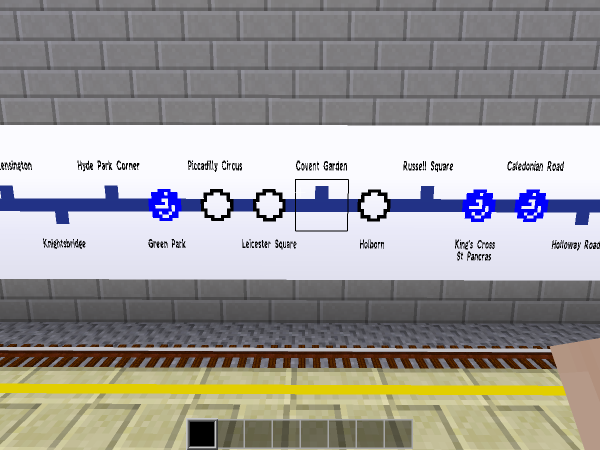
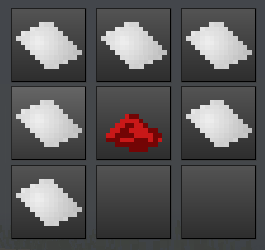
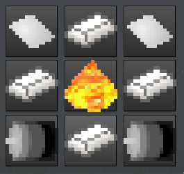
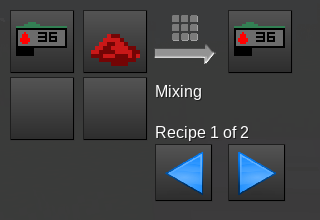
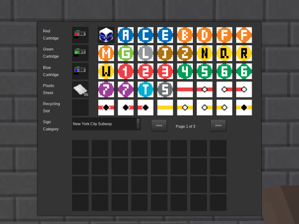
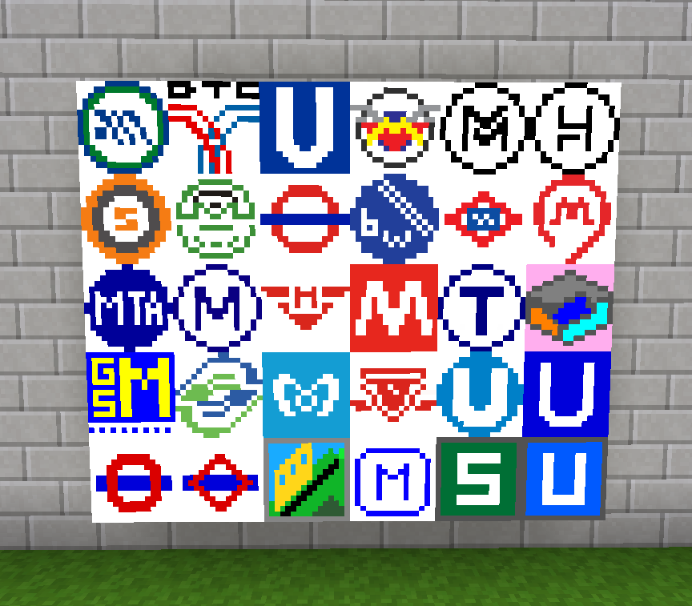

==========
metrosigns
==========

This is a mod for `Minetest <https://www.minetest.net/>`__, providing an extended selection of signs for use in your train and metro networks.

The mod includes:

* Semi-realistic signage from twenty major cities - the London Underground, the Paris Metro, the New York Subway - and more!
* Line and platform number signs from 1-99
* A sign-writing machine (for use in survival mode)
* Nodes from `advtrains_subwayblocks <https://git.gpcf.eu/?p=advtrains_subwayblocks.git>`__ and `trainblocks <https://github.com/maxhipp/trainblocks_bc>`__, if those mods aren't already loaded
* Over 1400 items in total

The mod includes and builds on material from the following mods:

* `advtrains_subwayblocks <https://git.gpcf.eu/?p=advtrains_subwayblocks.git>`__ by gpcf/orwell
* `trainblocks <https://github.com/maxhipp/trainblocks_bc>`__ by Maxx
* `roads <https://cheapiesystems.com/git/roads/>`__ by cheapie

Dependencies
------------

Requires Minetest v5.0 (or later). There are no hard dependencies.

Optional dependencies
---------------------

If default and `basic_materials <https://gitlab.com/VanessaE/basic_materials>`__ are loaded, the sign writing machine and ink cartridges are craftable.

If signs_api from `display_modpack <https://github.com/pyrollo/display_modpack>`__ is loaded, you can create signs with customisable text.

Downloads
---------

Latest release: `ZIP <https://github.com/axcore/metrosigns>`__, or `browse the code <https://github.com/axcore/metrosigns>`__.

Licences
--------

The sign writer and ink cartridges (code and textures) are licenced under CC-BY-SA 3.0 Unported.

Everything else is licenced under GNU Affero GPL.

Authors
-------

Code and textures: `A S Lewis <https://github.com/axcore/>`__.

Code and texture contributors: gpcf/orwell, Max, cheapie

Settings
--------

Most items are enabled by default. (This is a change from earlier versions). 

If you want to de-clutter your inventory, you should decide which to enable, and which to disable. In Minetest's main menu, click **Settings > All settings > Mods > metrosigns**. Click on **Enable to create all items** to de-select it.

Then, you can enable one or more of the options below it. Most users will prefer to use just London Underground signs, or just Paris Metro signs. Each of the 20 cities has a distinctive style, so enable the one you like best, and disable the others.

Items can be also be enabled/disabled by editing the file **settings.lua**.

By default, metrosigns provides its own line and platform signs in the range 11-20. The maximum range is 1-99. (If you specify invalid values, none of the signs are enabled).

The reason for using 11 as the minimum value, and not 1, is that the code copied from `advtrains_subwayblocks <https://git.gpcf.eu/?p=advtrains_subwayblocks.git>`__ and `trainblocks <https://github.com/maxhipp/trainblocks_bc>`__ already provides signs in the range 1-10. Note that those signs are labelled "1", "2", "3"..., whereas the new metrosigns are labelled "01", "02", "03"... (and so on). If you prefer to have two digits on *every* sign, you can change the minimum value to 1.

For line signs in the range 11-99, there are two colour schemes. By default, metrosigns now uses the same colour scheme as the `basic_trains <https://git.bananach.space/basic_trains.git>`__ mod (in which every sign from 1-99 has a unique background colour). Earlier versions of metrosigns used a repeating colour scheme (such that 7, 17 and 77 have the same background colour). If you prefer the original, you can restore it in settings.

How to use
----------

In survival mode, you can use the sign writing machine to create as many signs as you need.

The first step is to craft some ink cartridges. There are three types: red, green and blue. You'll need one of each.

Ink cartridges are crafted with plastic sheets and red/green/blue dye.

Then craft the sign writer itself using steel ingots, plastic sheets, simple motors and a simple energy crystal.

Place the machine somewhere and then right-click it to open the interface. You'll need to insert red, green and blue cartridges, as well as some more plastic sheets, into the slots.

When everything is added, you should be able to see some signs. To select a different set of signs, use the drop-down box on the left side of the interface. To "write" a sign, simply drag it into your inventory.

Sign writing consumes ink. The amount of ink used depends on the sign you're writing. Assuming a full set of carridges, you can write 4 lightboxes, 10 map signs or 20 line/platform signs.

If you insert a sign into the recycling slot, you will get back some of your ink. If you're really lucky, you'll recover a plastic sheet, too.

Cartridges can be refilled in the crafting grid.

More screenshots
----------------

.. image:: screenshots/example4.png
  :alt: Various line signs

.. image:: screenshots/example4b.png
  :alt: Various line signs in a different format

.. image:: screenshots/example5.png
  :alt: Various platform signs
