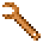
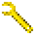
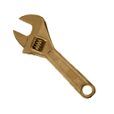
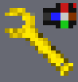
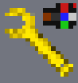

Minetest wrench for rotating nodes (rotate:wrench)
==================================================

This wrench (not to be confused with the technic wrench) makes the rotating
of nodes much more intuitive.

Different wrenches (wood, steel, copper, gold):

.. image:: images/wrench_steel_16.png

High-resolution images (128x128):

.. image:: textures/128/wrench_steel.png
.. image:: textures/128/wrench_copper.png
.. image:: textures/128/wrench_gold.png

Modes of operation
------------------

The wrench has three major modes of operation:

1) Rotation mode.
	In this mode, when punching a node, the node is rotated 90 degrees, the
	direction depending on the selected rotation direction. The following
	directions are available:

	- **clock-wise**: rotate the node so that the punched side rotates clockwise
	- **counter-clock-wise**: rotate the node so that the punched side rotates
	  counter-clockwise
	- **left**: rotate the node so that the punched side moves to the left
	- **right**: rotate the node so that the punched side moves to the right
	- **up**: rotate the node so that the punched side moves upwards
	- **down**: rotate the node so that the punched side moves downwards

	The configured direction is cycled by right-clicking. With the rotation direction,
	the picture of the wrench changes to indicate the current direction.

	As multiple rotations are most likely needed to correctly position a node,
	subsequent rotations of the same node do not add additional wear to the wrench.
	Punching 2 nodes alternatingly *does* add wear on every punch.

	Wrench images for the different directions (none, clockwise, counter-clockwise, left, right up, down):

	.. image:: images/wrench_copper_16.png
	.. image:: images/wrench_copper_cw_16.png
	.. image:: images/wrench_copper_ccw_16.png
	.. image:: images/wrench_copper_left_16.png
	.. image:: images/wrench_copper_right_16.png
	.. image:: images/wrench_copper_up_16.png
	.. image:: images/wrench_copper_down_16.png

	High resolution versions of the wrench:

	.. image:: textures/128/wrench_copper.png
	.. image:: textures/128/wrench_copper_cw.png
	.. image:: textures/128/wrench_copper_ccw.png
	.. image:: textures/128/wrench_copper_left.png
	.. image:: textures/128/wrench_copper_right.png
	.. image:: textures/128/wrench_copper_up.png
	.. image:: textures/128/wrench_copper_down.png

	The high resolution images can be found in the directory ``textures/128``. To
	use them, copy them from the ``textures/128`` directory to the ``textures``
	directory, or copy the ``textures/128`` directory into a texture pack.

2) Positioning mode (absolute)
	In this mode, when punching a node, the node is rotated to a preconfigured
	orientation with respect to the world. I.e. whatever the initial orientation
	of nodes, after rotation the sides will always be in the same direction (north,
	east, south, west, up, down).

	:Example: right-click a chest on any side. Say its front side was oriented east.
		Then punch any other chest on any side. Now, that chest's front side will
		also be towards the east.

	This mode is selected by crafting a wrench into absolute positioning mode. It
	can later be crafted into any other mode. See below.

	The desired position is configured by right-clicking any node, which configures
	the wrench to the current orientation of the clicked-node. For most regular nodes,
	which don't have an orientation, this resets the wrench to the default orientation.

	Example images (see below for details):

	.. image:: images/wrench_positioning_absolute_axis_rot.png
	.. image:: images/wrench_positioning_absolute_cube.png
	.. image:: images/wrench_positioning_absolute_cube_2.png

3) Positioning mode (relative)
	In this mode, when punching a node, the node is rotated to a preconfigured
	orientation with respect to the punched side and the player. I.e. if the wrench
	is configured by right-clicking a specific side of a node, then when another
	node is re-oriented, the punched side will match the punched side of the original
	node (i.e. same side and same rotation).

	The relative positioning mode is otherwise comparable to the absolute positioning
	mode.

	:Example: right-click a chest on its front side. Then punch any chest on any side,
		and the front side will rotate and take the place of the punched side.

	Example images (see below for details):

	.. image:: images/wrench_positioning_relative_axis_rot.png
	.. image:: images/wrench_positioning_relative_cube.png
	.. image:: images/wrench_positioning_relative_cube_2.png

Graphical indication of positioning modes:
------------------------------------------

For the absolute and relative positioning modes, two possible graphical
representations of the current submode are available: 'axis_rot' and 'cube'.
The 'cube' representation is recommended.
A third mode is supported, 'linear', but no corresponding images are included.

**Axis / rotation representation**

The 'axis_rot' orientation mode representation uses red dots (for absolute mode)
or blue dots (for relative mode) on a black background, in the upper-right corner
of the image.
The left dot indicates the axis direction: up, north, south, east, west, down
respectively.
The right dot indicates the rotation: 0, 90, 180 and 270 degrees respectively.

Absolute and relative positioning wrenches ('axis_rot' representation):

.. image:: images/wrench_positioning_absolute_axis_rot.png
.. image:: images/wrench_positioning_relative_axis_rot.png

**Cube representation**

The 'cube' orientation mode representation displays an exploded cube on a black
background. In the top-right, a colored dot indicates absolute mode (red) or relative
mode (blue).

The cube itself has six colors, and one should imagine looking at it from the front.
In the default orientation (axis=up and rotation=0), as seen from the north, the
white face would be directly in front (i.e. north), the blue face (think: 'sky')
would be on top, the brown face (think: 'earth') on the bottom, the red face on
the right (west), the green face on the left (east) (think: port and starboard
lights of boats, airplanes, etc.), and the black (actually dark grey) face would
be at the back (south).

If the wrench is in absolute positioning mode, any node punched will have the side
corresponding to the center color of the exploded cube ending up north, the side
corresponding to the upper color upwards, etc.

E.g. if the center color is blue, the original top side will be facing north.

If the wrench is in relative positioning mode, any node will have the side
corresponding to the center color rotate to the place of the punched node (i.e.
facing the player). The side corresponding to the right color will be to the right
of the player, etc.

E.g. if the center color is blue, the original top side will take the place of the
punched side (facing the player).

Absolute and relative positioning wrenches ('cube' representation):

.. image:: images/wrench_positioning_relative_cube.png
.. image:: images/wrench_positioning_relative_cube_2.png

Exploded cube image (default orientation), and matching views of the node:

.. image:: images/exploded_cube.png

.. image:: images/non_exploded_cube_bl.png

.. image:: images/non_exploded_cube.png

.. image:: images/non_exploded_cube_tr.png

Wrench materials
----------------

Wrenches come in four versions: wooden (optional), steel, copper, gold. The wooden
wrench is exceptionally cheap, and wears very fast (approximately 10 uses). The steel
wrench has approximately 450 uses, the copper wrench approximately 1.5 times as many,
the golden wrench approximately 2 times as many. The number of uses of the steel wrench
can be configured, automatically changing those of the copper and gold wrenches as well.

Crafting
--------

A wrench is crafted using 4 ingots (or 4 sticks for the wooden wrench). In case of
conflict with another mod, a few alternative recipies are available.

.. image:: images/wrench_wood_crafting.png
.. image:: images/wrench_copper_crafting.png

In addition, a rotation-mode wrench can be crafted to a relative positioning mode wrench,
which can be crafted to an absolute positioning mode wrench, which can be crafted back
to a rotation-mode wrench.

Privilege
---------

Optionally, the use of the wrench can be made subject to a privilege, named 'twist'.
This option is not enabled by default. It can be enabled in ``init.lua``.

API
---

This mod also provides an API for users to register their own wrenches. The following
methods are defined:

**rotate.register_wrench_recipe(material, ingredient)**

Register a recipe for an existing wrench. Example:

::

	rotate.register_wrench_recipe("steel", "moreores:tin_ingot")

**rotate.register_wrench(mod_name, material, description, ingredient, use_parameter, override)**

Register a wrench of a new material.

mod_name:
	The name of the mod registering the wrench

material:
	Short name of the material (e.g. "mithril").
	This string is used to construct the name of the images

description:
	Description of the material (e.g. "Mithril").
	This string is used in the display name of the tool. E.g.: "Mithril wrench"

ingredient:
	The ingredient to use to craft this type of wrench (e.g. "moreores:mithril_ingot")

use_parameter:
	This parameter specifies the number of uses. It can be sepcified in two ways:

	- As an integer: the maximum number of uses (e.g.: 2, for 2 uses)
	- As a float: the number of uses relative to the steel wrench (e.g.: 2.01, for
	  (a tiny bit more than) two times as many uses as the steel wrench.

override:
	Optional parameter. If true, then reregistering an existing wrench will be accepted.
	Else an error message is printed, and the registration is ignored.

Example:

::

	rotate.register_wrench("mywrench", "mithril", "Mithril", "moreores:mithril_ingot", 1.8)

**rotate.register_wrench(table, override)**

Alternative invocation of *register_wrench*; all wrench parameters are specified in a table.

::

	rotate.register_wrench({
		mod_name = "mywrench",
		material = "mithril",
		description = "Mithril",
		ingredient = "moreores:mithril_ingot",
		use_parameter = 1.8,
		})

**rotate.wrench_uses_steel**

The number of configured uses for a steel wrench.

This is a variable, provided for convenience only - the rotate mod does *not* use it.

**Textures**

Of course, textures must be created as well. The following are needed:

::

	wrench_<material>.png
	wrench_<material>_ccw.png
	wrench_<material>_cw.png
	wrench_<material>_down.png
	wrench_<material>_left.png
	wrench_<material>_right.png
	wrench_<material>_up.png

If desired, the bash script 'textures/generate' can be used to generate the
images; if an entry is added to the list of materials:

::

	materials="
		wood    #6C4913 100
		steel   #FFFFFF 130
		copper  #F6A860 100
		gold    #FFe900 130
		mithril #313196 100
		"

and the script is run, 18x18 and 128x128 images will have been created for the new
wrenches (and all other images will have been regenerated as well). Note that imagemagick
is required for the script to function.

The script is provided 'as is', as an extra service only. In particular, it is not
intendend to be able to run on Windows (or anywhere else than on my system, for that
matter :-) - although you are welcome to try.

Notes
-----

The operation of the wrench has been optimized: all required information is precomputed
at startup. Actual operation of a wrench basically requires just a few table lookups.

Most images used for the wrench were generated from a few base images. The script and
base images are included, for the interested party.

A technical note for the interested party: the reference side of the relative
positioning mode is north. I.e. after right-clicking a node with an absolute positioning
wrench, and right-clicking the north side of that node with a relative positioning wrench,
the positioning submode indicators of both wrenches will look the same, except of course
for the colors of the red and blue pixels indicating absolute or relative mode.

