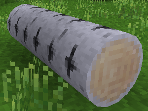

### ROUND TRUNKS
  
**_Turns cubic tree trunks to cylindrical._**

**Version:** 1.1.0  
**Source code's license:**  [EUPL v1.2][1] or later.  
**Media (Textures, Models, Sounds) license:** [CC BY-SA 4.0][2] - [GPL v3.0][3]

**Dependencies:** none
**Supported:** default (found in [Minetest Game][4])

**Optional features:**  
 - "X" shaped leaves.
 - Toggle textures overrider.

**How to toggle them:** Settings -> All settings -> Mods -> round_trunks

**API for third party mods:**  
See 

### Installation

Unzip the archive, rename the folder to round_trunks and place it in  
../minetest/mods/

If you only want this to be used in a single world, place it in  
../minetest/worlds/WORLD_NAME/worldmods/

GNU+Linux - If you use a system-wide installation place it in  
~/.minetest/mods/

For further information or help see:  
https://wiki.minetest.net/Help:Installing_Mods

[1]: https://eur-lex.europa.eu/legal-content/EN/TXT/?uri=CELEX:32017D0863
[2]: https://creativecommons.org/licenses/by-sa/4.0/
[3]: https://www.gnu.org/licenses/gpl-3.0.en.html
[4]: https://github.com/minetest/minetest_game
