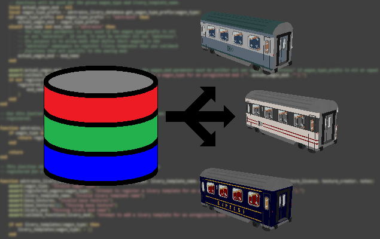

# AdvTrains Livery Database

This mod is a library that provides an API for a non-persistent, in-game database for livery templates and designs for [Advanced Trains](https://content.minetest.net/packages/orwell/advtrains/). Participating mods that use this API can share their livery templates and designs with other mods.  Mods can also optionally register callback functions that provide mod specific customization of their liveries such as support for weathering effects, external display of line numbers, etc.

Mod developers should consult the included [API reference guide](API_reference_guide.md) for information about using this library.

## Licenses

Copyright © 2023-2024 Marnack

- AdvTrains Livery Database is licensed under the GNU AGPL version 3 license.
- Unless otherwise specified, AdvTrains Livery Database media (textures and sounds) are licensed under [CC BY-SA 3.0 Unported](https://creativecommons.org/licenses/by-sa/3.0/).

