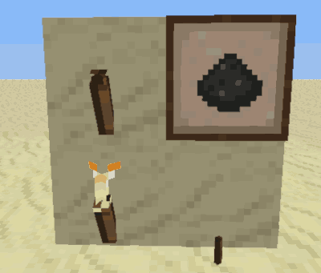

minetest mod Real Torch
=======================

Made torchs more realistic way behaviour.

Information
-----------

This mod is named `real_torch`, changes torches so that they have a life
of 20-30 minutes which is configurable using the `torch_min_duration`
and `torch_max_duration` settings. It also can be relight using coals, flint or steel, and can be affected by water.

- 2x coal lumps can be crafted into 12x coal powder
- coal powder and an unlit torch can be crafted into a lit torch again
- punching an unlit torch with coal powder relights it
- punching an unlit torch with flint & steel relights it
- punching an unlit torch with gunpowder explodes and relights it
- never punch a lit torch with gunpowder, ow!
- water near torches make them drop as unlit torches
- coal powder can also be used for fuel or crafted into black dye

https://forum.minetest.net/viewtopic.php?f=11&t=15721

Technical information
---------------------

This mod does not override the normal torch, so once you put a torch if
you removed the mod those will remains as normal ones if relights/lights it!

### New Craft items

It added new coal, rest of torch related are just overrides for features.

| name | node |
| ---- | ---- |
| Coal Powder | real_torch:coal_powder |

Changelog:
----------

- 0.1 - Initial upload
- 0.2 - Punching unlit torch with coal powder relights torch
- 0.3 - Torches are 2D and override any that are 3D
- 0.4 - Changed my mind, now detects old 2D or new 3D torches and works accordingly
- 0.5 - 2x coal lumps give 10x coal dust, also fixed check for ethereal mod
- 0.6 - Burnout and extinguish sounds added by tacotexmex :)
- 0.7 - Torches can be re-lit using flint & steel and gunpowder, settings added
- 0.8 - Updated to newer functions, requires Minetest 0.4.16 to run
- 0.9 - Use on_flood from newer 5.x functions to drop torches
- 1.0 - Tweak code and use use_texture_alpha = "clip" to stop warnings

License
-------

**Code**
The MIT License (MIT), Copyright (c) 2016 TenPlus1
Check [license.txt](license.txt)

**Sizzle sound **
CC0 1.0 Universal (CC0 1.0)
Check [sounds/license.txt](sounds/license.txt)

**Extinguish sound**
Attribution 3.0 Unported (CC BY 3.0)
Vlatko Blažek
Check [sounds/license.txt](sounds/license.txt)
