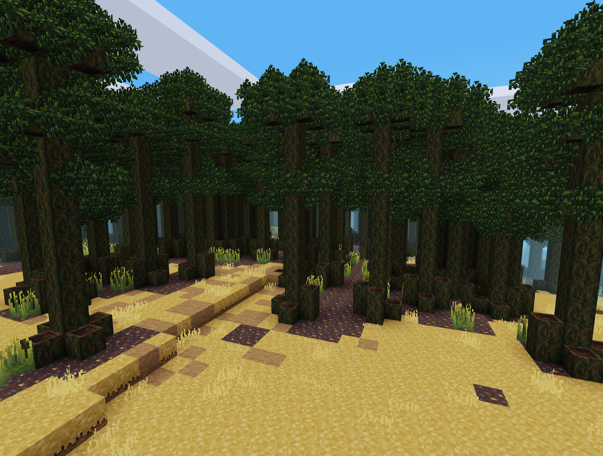

# defaultpack Remastered

_A remastered version of the Minetest Game default texture pack._

 ~ It aims for a smoother and realistic look which still is pretty much based on the defaultpack.

Cause in general I like the realistic and rather simple style, there are some textures I really love (above all the permafrost nodes). But some others tend to be a bit expressionless, with no real substance or structure - for example dirt - and some just have weird colors (Sand(stone) has a greenish tint to it?!).

So for most of the textures I only minimized the color palette and shifted color shades a bit to overall have a uniform look:

## Screenshots

 

## Status

Contains so far:

 - default (~39%)
 - unified_inventory

## License

Because many textures are based on those of the [Minetest Game](https://github.com/minetest/minetest) which mainly were distributed under the [CC BY-SA 3.0](https://creativecommons.org/licenses/by-sa/3.0/legalcode) license those still are. Similar applies to textures for other mods.
To specify which textures this concerns / _what_ the basis and who its author is, there should be a file called "license.md" in every mod directory of this pack, which also contains information about the originally used license.

The textures I made from scratch are licensed under the [CC BY-SA 4.0](https://creativecommons.org/licenses/by/4.0/legalcode) license.

## ToDo

- [ ] Complete the textures for default mod
- [ ] Do the rest 👌
- [ ] ...and then also provide all the licensing informations
